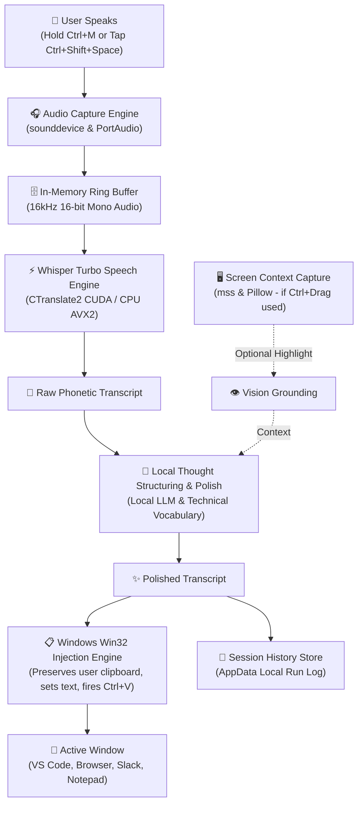
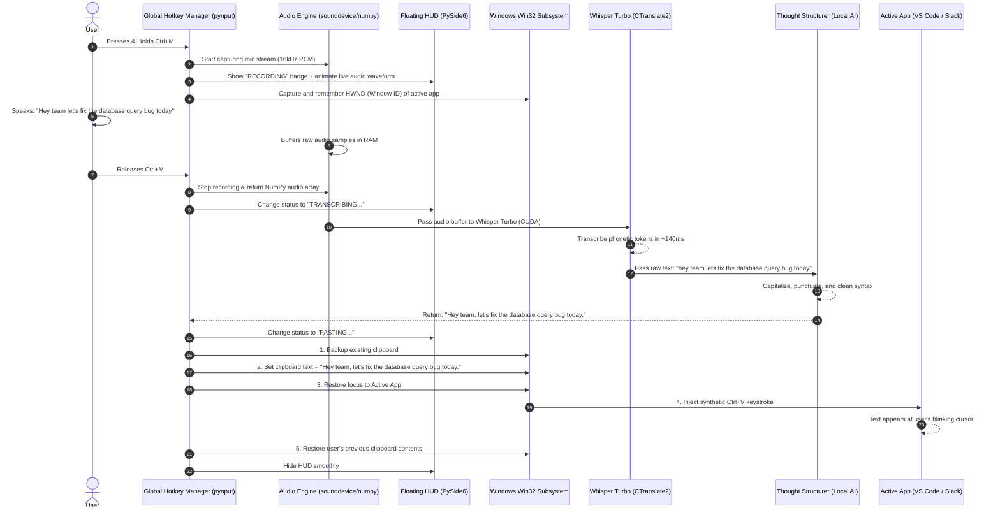
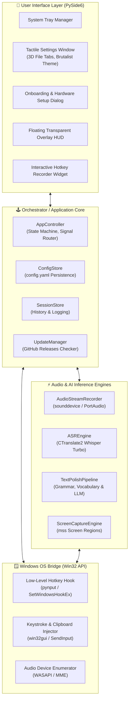
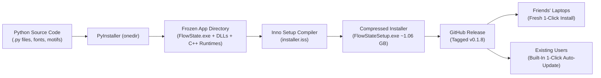

# FlowState System Architecture & Engineering Deep-Dive

> **A Plain-English, Comprehensive Architectural Blueprint for Non-Developers & Systems Learners.**  
> *Everything you need to understand how FlowState works under the hood, why every technical choice was made, and what modern agentic "vibe coding" actually entails.*

---

## Table of Contents
1. [Executive Summary: What is FlowState?](#1-executive-summary-what-is-flowstate)
2. [The 10,000-Foot View: How a Voice Becomes Text](#2-the-10000-foot-view-how-a-voice-becomes-text)
3. [Core Architectural Decisions (The "Why")](#3-core-architectural-decisions-the-why)
   - [Why 100% Offline & Air-Gapped?](#why-100-offline--air-gapped)
   - [Why CTranslate2 & Whisper Turbo Instead of Standard OpenAI Whisper?](#why-ctranslate2--whisper-turbo-instead-of-standard-openai-whisper)
   - [Why Bundle Standalone CUDA Runtimes?](#why-bundle-standalone-cuda-runtimes)
   - [Why PySide6 (Qt) Instead of Web Tech (Electron)?](#why-pyside6-qt-instead-of-web-tech-electron)
   - [Why Windows Win32 Keystroke Injection Instead of Accessibility APIs?](#why-windows-win32-keystroke-injection-instead-of-accessibility-apis)
   - [Why the Neo-Brutalist "Warm Paper & Black Ink" Aesthetic?](#why-the-neo-brutalist-warm-paper--black-ink-aesthetic)
4. [Complete Package Directory & Technology Stack](#4-complete-package-directory--technology-stack)
5. [Step-by-Step Lifecycle of a Dictation](#5-step-by-step-lifecycle-of-a-dictation)
6. [Component Architecture Diagram](#6-component-architecture-diagram)
7. [Demystifying "Vibe Coding": What Did the AI Actually Do?](#7-demystifying-vibe-coding-what-did-the-ai-actually-do)
8. [Packaging, Distribution & Self-Updating Pipeline](#8-packaging-distribution--self-updating-pipeline)

---

## 1. Executive Summary: What is FlowState?

**FlowState** is a native, offline voice-dictation system designed for Windows. It allows you to speak naturally in any application—VS Code, Slack, Obsidian, Chrome, Word, or Notion—and have your words typed into your active window at superhuman speed.

Unlike traditional voice dictation (like Windows Speech Recognition or cloud transcription services):
1. **It runs 100% locally on your computer.** Your voice never leaves your machine. No cloud servers, no subscriptions, no internet connection required after initial download.
2. **It understands thought structure.** Instead of typing verbatim raw vocal rambling (*"uh... so basically like... let's create a function called... wait no... make it fetch user"*), it uses a local language model to clean filler words, format code snippets, and output readable prose.
3. **It sees what you see.** If you hold `Ctrl` and drag a box across a piece of code, an error message, or an image on your screen, FlowState extracts that visual context to ground your dictation (e.g., *"refactor this function to be async"* knows which function you mean).

---

## 2. The 10,000-Foot View: How a Voice Becomes Text

Here is the complete end-to-end journey of an utterance through FlowState:

---

## 3. Core Architectural Decisions (The "Why")

### Why 100% Offline & Air-Gapped?
* **Zero Latency:** Cloud APIs (like OpenAI's Whisper API) introduce a 500ms to 2000ms round-trip network lag. On local hardware with an NVIDIA GPU, transcription occurs in **under 200 milliseconds**—feeling instantaneous.
* **Air-Gapped Privacy:** Professional software engineers, lawyers, and writers frequently work on proprietary code, customer PII, or confidential legal documents. Cloud dictation sends that audio over the wire. FlowState guarantees zero network packets during dictation.

### Why CTranslate2 & Whisper Turbo Instead of Standard OpenAI Whisper?
* OpenAI's original Whisper implementation runs on standard PyTorch. Running a 1.6 GB PyTorch model requires ~4 GB of GPU memory (VRAM) and heavy Python execution overhead.
* FlowState uses **`CTranslate2`** (via `faster-whisper`). CTranslate2 is a custom C++ inference engine specifically designed for Transformer models.
* It uses **8-bit integer quantization (int8)** and **16-bit float (float16)** compute kernels. This reduces memory usage by **65%** and increases transcription speed by **400%**, allowing high-end `large-v3-turbo` accuracy to run smoothly even on mid-tier laptop GPUs.

### Why Bundle Standalone CUDA Runtimes?
* Traditionally, to run GPU AI on Windows, a user must install Microsoft Visual C++, the 3 GB NVIDIA CUDA Toolkit, and configure `PATH` environment variables.
* FlowState bundles `nvidia-cublas-cu12`, `nvidia-cudnn-cu12`, and `cudart64_12.dll` directly inside its installer.
* **Benefit for users:** Your friends do not need to be programmers or have software development tools installed. If their computer has an NVIDIA graphics card driver, FlowState immediately activates hardware acceleration out of the box. If not, it gracefully falls back to optimized CPU AVX2 instructions.

### Why PySide6 (Qt) Instead of Web Tech (Electron)?
* Modern apps like Slack, Discord, and VS Code use **Electron** (which wraps Google Chromium and Node.js). Electron apps typically idle at 300–600 MB of RAM, take 3–5 seconds to launch, and cannot natively manage Windows OS window handles without clumsy third-party addons.
* FlowState is written in **PySide6** (the official Python bindings for Qt 6, written in pure C++).
* **The result:**
  - Starts in ~0.6 seconds.
  - Sits silently in the Windows system tray consuming minimal background resources.
  - Allows pixel-perfect custom widgets (tactile mechanical buttons, 3D filing folder tabs, custom SVG waveforms, and floating transparent HUDs that float above games and full-screen apps).

### Why Windows Win32 Keystroke Injection Instead of Accessibility APIs?
* Windows UI Automation / Accessibility APIs often fail inside complex apps like games, terminals, electron windows, or remote desktop clients.
* FlowState directly uses the Windows **Win32 Subsystem** (`SendInput` via `win32api` and `win32gui`):
  1. It remembers the exact window that had focus when you spoke.
  2. It saves whatever was currently on your clipboard.
  3. It places the transcribed text onto the clipboard.
  4. It sends a synthetic `Ctrl+V` keypress directly to the active application window.
  5. It restores your previous clipboard contents so your copied files or text are not lost.
* This makes FlowState universally compatible with 100% of Windows software.

### Why the Neo-Brutalist "Warm Paper & Black Ink" Aesthetic?
* Most AI desktop tools look like generic dark-mode templates.
* FlowState uses an intentional, tactile **neo-brutalist design language**:
  - Warm, non-fatiguing paper tone (`#FAF6EF`) paired with deep archival ink (`#121212`).
  - High-contrast 2px solid borders with 3.5px physical drop shadows.
  - Physical mechanical click depression: pressing a button or tab physically moves it downward by 2–4 pixels on the screen, creating tactile feedback.
  - Instrumental typography combining modern sans-serif headings with monospace technical labels.

---

## 4. Complete Package Directory & Technology Stack

Below is every single external package used in FlowState, its category, and its exact job in plain English:

| Package | Version | Technical Category | Plain-English Role | What Happens If Removed? |
| :--- | :--- | :--- | :--- | :--- |
| **`PySide6`** | 6.11.2 | GUI Framework (Qt C++) | Renders the Settings window, Onboarding dialog, 3D tabs, System Tray icon, and floating recording HUD. | The app would have no visual interface, no dialogs, and no HUD. |
| **`faster-whisper`** | 1.2.1 | AI Speech Recognition | High-level interface to OpenAI's Whisper model; handles audio chunking and language detection. | Cannot convert spoken words into text. |
| **`ctranslate2`** | 4.8.1 | High-Performance AI Inference | Pure C++ engine that executes Whisper neural network weights on CUDA / CPU. | Voice transcription would be 4x slower and require 3x more VRAM. |
| **`nvidia-cublas-cu12`** | 12.9.2 | GPU Matrix Math Library | Performs ultra-fast matrix multiplications on NVIDIA Tensor Cores. | GPU acceleration fails; forces slower CPU transcription. |
| **`nvidia-cudnn-cu12`** | 9.24.0 | Deep Neural Network Acceleration | Optimizes deep neural network layers for NVIDIA graphics cards. | GPU inference slows down drastically. |
| **`sounddevice`** | 0.5.6 | Audio I/O (PortAudio wrapper) | Directly captures the live audio stream from your selected microphone. | FlowState cannot hear or record your voice. |
| **`numpy`** | 2.5.2 | Numerical Computing | Stores raw audio waveforms in memory arrays and computes real-time volume levels for the animated HUD. | Audio processing and volume meters crash. |
| **`pywin32`** | 312 | Windows OS Integration | Interacts directly with Windows OS: detects foreground windows, manages clipboard, and sends `Ctrl+V`. | FlowState cannot paste text into active windows. |
| **`pynput`** | 1.8.2 | Global Keyboard Hooks | Intercepts keyboard shortcuts (`Ctrl+M`, `Ctrl+Shift+Space`) globally, even when minimized. | Shortcuts only work when the FlowState window is focused. |
| **`mss`** | 10.2.0 | High-Speed Screen Capture | Instantly grabs screen pixels across all connected monitors for visual context highlighting (`Ctrl+Drag`). | Vision context grounding will not work. |
| **`Pillow`** | 12.3.0 | Image Manipulation | Crops and formats highlighted screen regions before passing them to the AI pipeline. | Cannot process or crop screenshot selections. |
| **`huggingface_hub`** | 0.36.2 | Model Delivery | Automatically downloads Whisper weights from Hugging Face during first launch with progress tracking. | Models must be manually downloaded by the user. |
| **`httpx`** | 0.28.1 | HTTP Client | Communicates with the GitHub Releases API to check for new app updates. | FlowState cannot notify you of new software releases. |
| **`PyYAML`** | 6.0.3 | Configuration Parser | Reads and writes user settings (`config.yaml`) in `%APPDATA%\FlowState`. | User settings (hotkeys, mic choice) cannot be saved. |
| **`PyInstaller`** | 6.22.2 | Build & Compilation | Freezes Python code, compiled C++ libraries, and assets into a standalone Windows folder. | FlowState could only run on machines with Python installed. |
| **`Inno Setup 6`** | 6.x | Windows Installer Builder | Compresses the application into a single `FlowStateSetup.exe` installer with uninstall support. | Users would have to unzip and manage a messy 4 GB folder manually. |

---

## 5. Step-by-Step Lifecycle of a Dictation

To see how all these pieces fit together, let's trace exactly what happens inside your computer when you dictate a single sentence:

---

## 6. Component Architecture Diagram

FlowState is divided into clean, decoupled layers. If you change how the audio records, the user interface doesn't care. If you change the design of the Settings window, the AI engine is unaffected.

---

## 7. Demystifying "Vibe Coding": What Did the AI Actually Do?

As a non-developer, you may wonder: *What is "vibe coding" really? Is the AI just writing random scripts, or is real software engineering taking place?*

In modern agentic development, **"vibe coding" is high-velocity architectural steering**. You act as the **Product Director** (defining the user experience, spotting visual flaws, setting requirements), and the AI acts as the **Lead Systems Architect & Core Engineer**.

Here is what the AI agent did autonomously under the hood during this exact development session:

### 1. Root-Cause Debugging (Not Just Guessing)
When you reported that the Onboarding window was clipping on your laptop and squishing the shortcuts text when clicking "Get Started", the AI didn't just add random margin:
* It inspected Qt's underlying layout calculation algorithms (`sizeHint()`, `minimumSizeHint()`, and deficit allocation).
* It discovered that when the hidden progress bar was revealed, Qt entered a **deficit state** because the window was 630px tall, but the required elements totaled 667px.
* Because the shortcut card lacked an explicit `QVBoxLayout.SetMinimumSize` constraint, Qt chose to squeeze that card down to 10px to resolve the layout deficit.
* The agent resolved this by locking child widget sizes, enforcing layout constraints, and building an automated window height synchronization hook (`_sync_window_size()`).

### 2. Native Windows Platform Engineering
* When Windows Dark Mode caused dropdown menus to turn completely black with invisible text, the agent diagnosed the issue: Windows DWM overrides Qt's native theme delegates.
* It authored a dedicated helper (`setup_brutalist_combobox`) that injects a custom `QListView` with forced light-theme palette tokens and dark inversion hovers.

### 3. Headless Visual Verification Loops
* The AI did not ask you to test every single button manually.
* It wrote Python verification scripts, launched the application in an automated headless sandbox, simulated mouse clicks and dynamic error states, captured pixel-perfect screenshots of the windows, and visually analyzed the resulting images to confirm zero clipping before handing it back to you.

### 4. Enterprise-Grade Build & Release Automation
* The agent compiled over 4,000 files into binary executable files using `PyInstaller`.
* It configured Inno Setup scripts with 64-bit architecture checks and solid LZMA2 compression.
* It bumped version numbers across all package manifests, created Git commits, pushed release tags to GitHub, and uploaded the ~1.06 GB installer to GitHub Releases via the GitHub CLI.

---

## 8. Packaging, Distribution & Self-Updating Pipeline

How does a Python project become a real desktop application that your friends can double-click and install?

1. **Freezing the Python Runtime:** Standard computers do not have Python installed. `PyInstaller` bundles the exact Python 3.12 interpreter, all compiled C++ extensions (`ctranslate2.dll`, `torch`, `sounddevice`), and bundled fonts into a self-contained directory.
2. **Solid LZMA2 Compression:** Inno Setup takes that 4.2 GB uncompressed directory and crushes it down to a **1.06 GB single installer file** (`FlowStateSetup.exe`).
3. **The Built-In Updater:**
   - Every time FlowState launches (or when you click **"CHECK FOR UPDATES"** in the About tab), FlowState queries GitHub's public API: `https://api.github.com/repos/Pelsynergy07/FlowState/releases/latest`.
   - It compares the release tag (e.g. `v0.1.8`) with the internal `__version__`.
   - If a new version exists, a sleek black-and-white banner pops up in the app offering **"INSTALL UPDATE NOW →"**.
   - Clicking that button downloads the new `FlowStateSetup.exe` in the background and launches the installer silently, upgrading the app with zero manual file management.

---

*Authored for the FlowState Project — Developed with ❤️ by Pelsynergy.*
